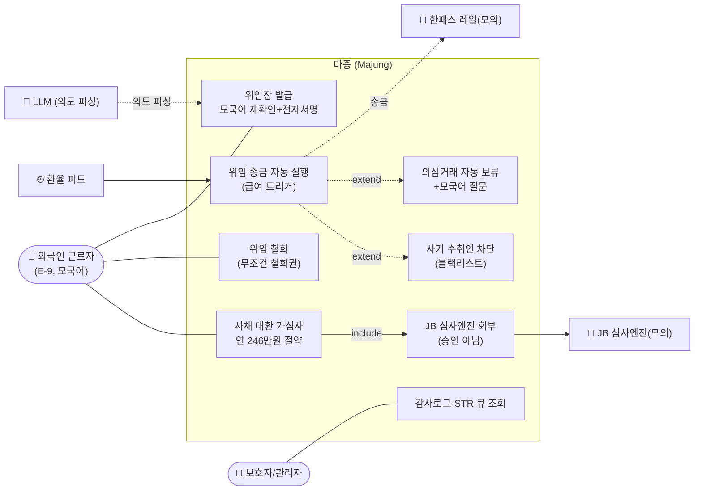
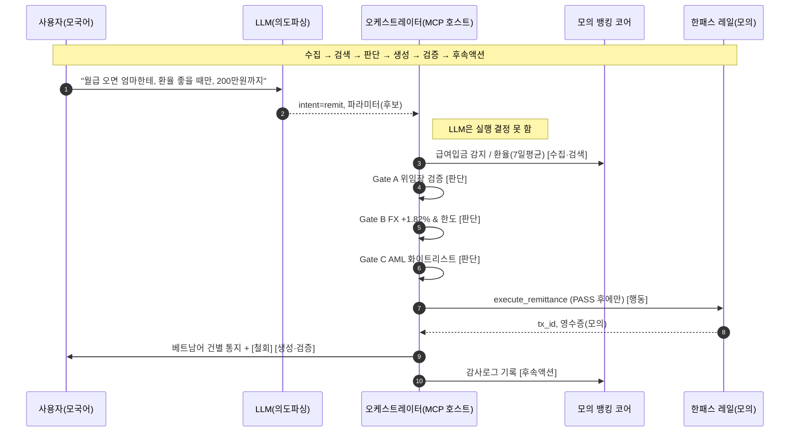
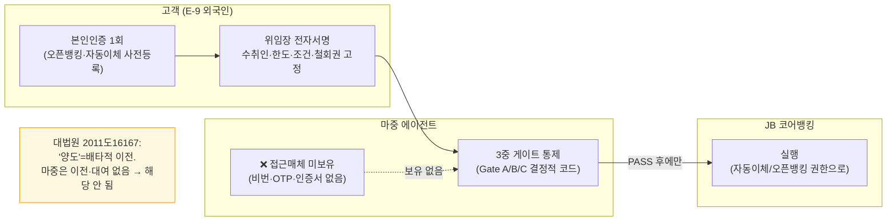
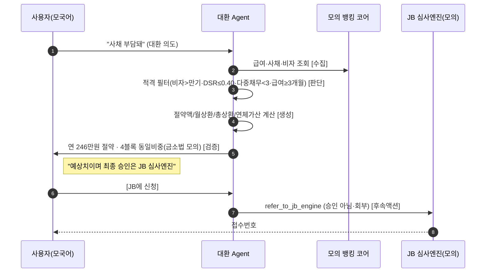

# 마중(Majung) 다이어그램 모음

> 기능명세서 §2(시스템 구성도)·§4(주요 기능 흐름도)에 캡처해 삽입.
> GitHub에서 그대로 렌더됨. UML 정식 유스케이스는 [`usecase.puml`](./usecase.puml) 참고.
> 평가 라벨을 자구 그대로 사용: **판단 → 행동 → 검증/개선** / **수집 → 검색 → 판단 → 생성 → 검증 → 후속액션**

---

## 1. 유스케이스 (§4)

---

## 2. 시스템 구성도 — 3중 게이트 (§2)

---

## 3. 핵심 기능 흐름 — 1막 위임 송금 e2e (§4)

---

## 4. 접근매체 비보유 구조 — 전금법 제6조③ 대응

> 마중은 접근매체(비번·OTP·인증서)를 받지도 보관하지도 않는다.
> 실행 권한은 고객이 사전 등록한 오픈뱅킹/자동이체 권한이며, JB 결정적 코드가 그 위에서 실행한다.

---

## 5. AP2 ↔ 마중 3중 게이트 정합

> Google AP2(Agent Payments Protocol) 3중 Mandate와 마중 3중 게이트는 1:1 대응한다.
> 마중은 임의 설계가 아니라 업계가 수렴 중인 위임형 결제 거버넌스를 구현했다.

| AP2 Mandate | 마중 게이트 | 역할 |
|---|---|---|
| Intent Mandate — 에이전트 의도 인증 | Gate A — 위임장 검증(전자서명·범위·철회) | 고객 의사 고정 |
| Cart Mandate — 거래 내용 승인 | Gate B — Rule 한도·조건(FX Rule·금액·기간) | 조건 충족 판단 |
| Payment Mandate — 실행 인가 | Gate C — 화이트리스트 + AML | 수취인·리스크 차단 |

---

## 6. 핵심 기능 흐름 — 2막 대환 가심사 (§4)

