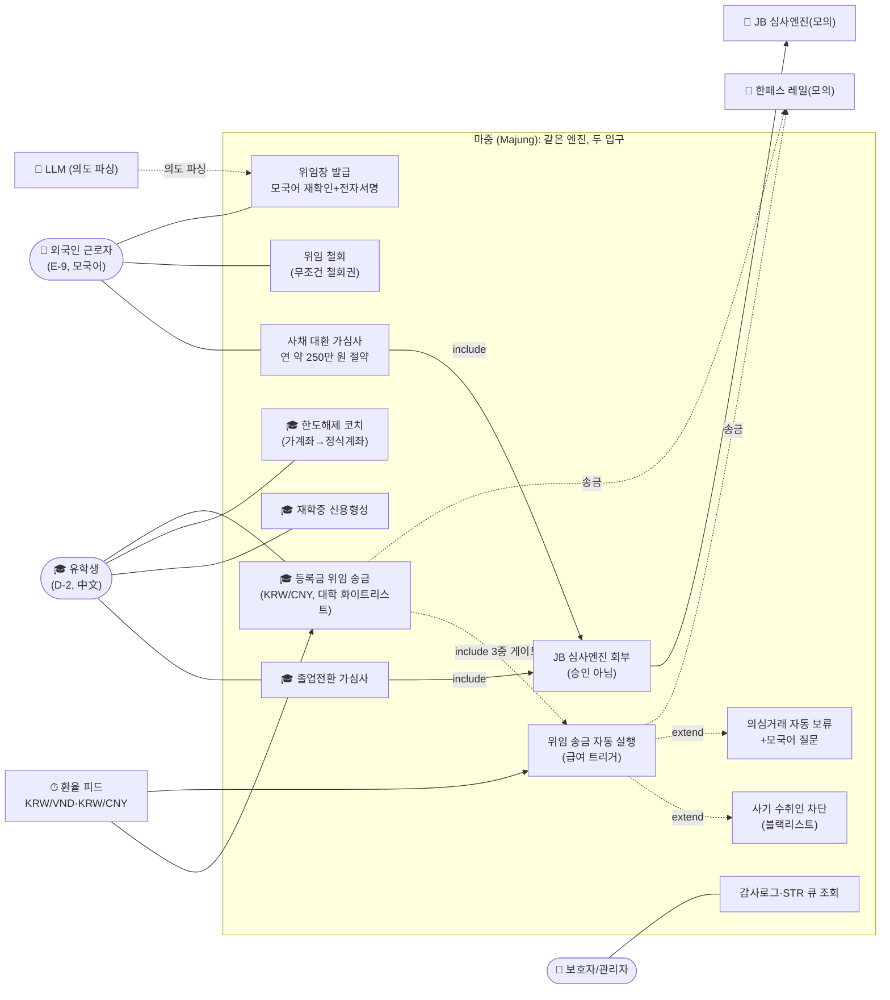
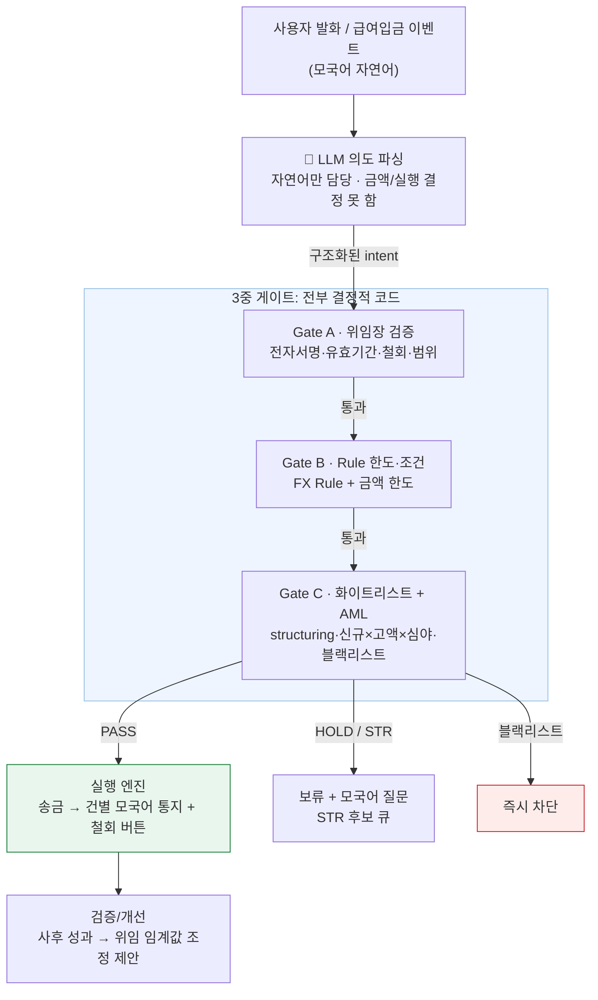
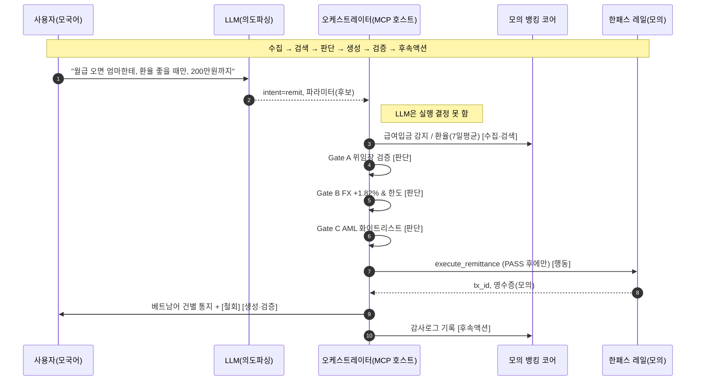
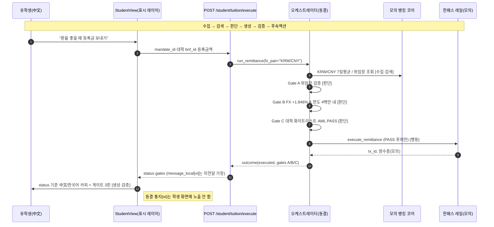
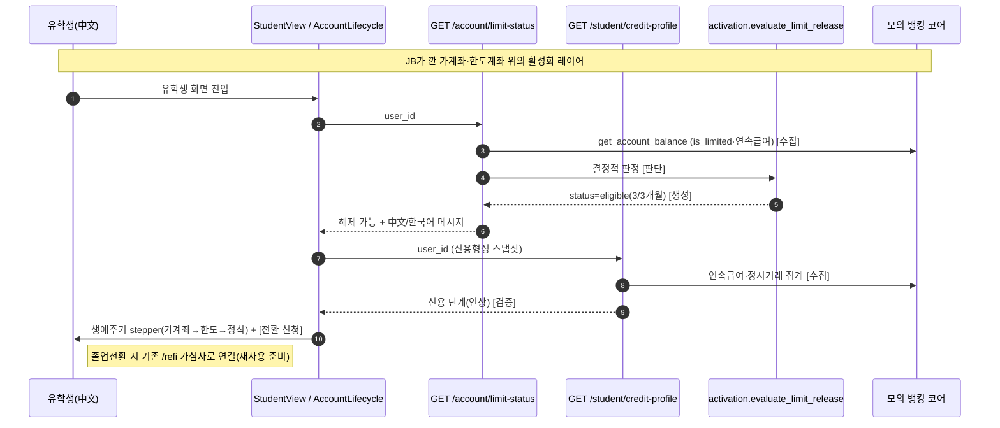

# 마중(Majung) 다이어그램 모음

> 기능명세서 §2(시스템 구성도)·§4(주요 기능 흐름도)에 캡처해 삽입.
> GitHub에서 그대로 렌더됨. UML 정식 유스케이스는 [`usecase.puml`](./usecase.puml) 참고.
> 평가 라벨을 자구 그대로 사용: **판단 → 행동 → 검증/개선** / **수집 → 검색 → 판단 → 생성 → 검증 → 후속액션**

---

## 1. 유스케이스 (§4)

> **v2 핵심**: 유학생 등록금 송금(SUC1)은 근로자 자동 송금(UC2)과 **동일한 위임장·3중 게이트**를
> `fx_pair=KRW/CNY`로 그대로 재사용한다(새 송금 엔진 없음). CB·스테이블코인은 Future Work.

---

## 2. 시스템 구성도: 3중 게이트 (§2)

---

## 3. 핵심 기능 흐름: 1단계 위임 송금 e2e (§4)

---

## 4. 핵심 기능 흐름: 2단계 대환 가심사 (§4)

---

## 5. 핵심 기능 흐름: v2 유학생 등록금 위임 송금 (§4)

> **기존 3중 게이트 그대로 재사용.** 신규는 얇은 엔드포인트 하나(`/student/tuition/execute`)뿐이며,
> 동일 `run_remittance` 를 `fx_pair="KRW/CNY"` 로 호출한다. 오케스트레이터·룰 무수정.

---

## 6. 핵심 기능 흐름: v2 가계좌 → 한도해제 → 활성화 (§4)

> **자금 이동 없음.** read-only 코치. 한도해제 판정은 신규 결정적 함수
> `activation.evaluate_limit_release`(연속급여 ≥3개월). 송금 경로와 무관.

